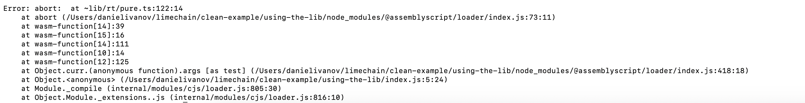

# as-clean-example
This repo is intended to showcase a potential problem with exporting Arrays as library.

When using the imported lib code directly it works:

1. Go to `imported-lib`
2. Execute `npm install`
3. Run `npm run asbuild`
4. Run `node index.js`

When trying to execute the code from another AS project, it throws:

1. Go to `using-the-lib`
2. Execute `npm install`
3. Run `npm run asbuild`
4. Run `node index.js`

There is an error that is displayed:

